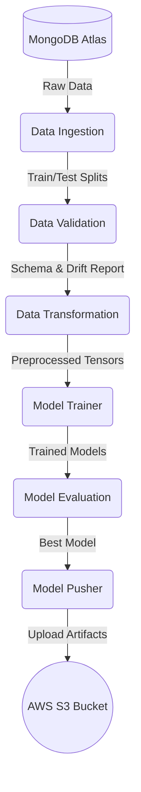

# 🌍 US Visa Approval Prediction - End-to-End MLOps Project


## 📌 Project Overview

The **US Visa Approval Prediction** system is a complete, production-ready Machine Learning Operations (MLOps) pipeline. It is engineered to predict whether a US Visa application will be approved or denied based on applicant demographics, employment details, and historical data.

Beyond just a Machine Learning model, this repository embodies industry-standard software engineering and MLOps practices. It features a fully modular architecture encompassing automated data ingestion from NoSQL databases, rigorous data validation, advanced feature engineering, robust model training, and continuous deployment capabilities leveraging AWS cloud infrastructure.

---

## 🎯 Problem Statement

The Immigration and Nationality Act (INA) of the US permits foreign workers to come to the United States to work for a temporary or permanent basis. However, the process of reviewing and approving visa applications (such as H-1B, L-1, etc.) is highly tedious, time-consuming, and resource-intensive for the Office of Foreign Labor Certification (OFLC).

**The Solution:** An automated machine learning classification system that analyzes applicant profiles and historical trends to predict the likelihood of visa approval. This prescreening tool helps agencies prioritize applications, identify potential rejections early, and significantly reduce manual review bottlenecks.

---

## 🏗️ Architecture & Pipeline Flow

The project follows a strict Object-Oriented pipeline approach. Each stage is encapsulated within its own component, passing artifacts downstream.



### 1. 📥 Data Ingestion

- **Source:** Connects securely to a remote **MongoDB Atlas** cluster using `pymongo`.
- **Process:** Fetches the raw visa dataset, converts it into a structured Pandas DataFrame, and intelligently splits the data into Training and Testing sets.
- **Output:** `train_set.csv`, `test_set.csv`.

### 2. 🛡️ Data Validation (Evidently AI)

- **Schema Check:** Validates that the incoming data matches the expected schema (correct columns, data types, missing value thresholds).
- **Drift Detection:** Integrates **Evidently AI** to compare the statistical distribution of the training data against the test data (or incoming production data). It generates comprehensive drift reports to ensure model reliability.
- **Output:** Validation status and Drift Report JSON/HTML.

### 3. 🔄 Data Transformation

- **Feature Engineering:** Handles missing values, encodes categorical variables (One-Hot Encoding, Label Encoding), and scales numerical features using Scikit-Learn pipelines.
- **Imbalance Handling:** Utilizes `imbalanced-learn` (e.g., SMOTE) to address class imbalances in the target variable (Approved vs. Denied).
- **Serialization:** Saves the fitted preprocessor object (`preprocessor.pkl`) using `dill` for consistent application during inference.
- **Output:** Transformed NumPy arrays and preprocessor artifact.

### 4. 🧠 Model Trainer

- **Algorithm Selection:** Tests multiple algorithms including **XGBoost, CatBoost, Random Forest, and Decision Trees**.
- **Hyperparameter Tuning:** Conducts grid search to find the optimal parameters for the highest accuracy and F1-score.
- **Serialization:** Saves the best-performing model as `model.pkl`.

### 5. 📊 Model Evaluation

- **Performance Metrics:** Evaluates the trained model against the test dataset using accuracy, precision, recall, and F1-score.
- **Acceptance Criteria:** Compares the new model's performance against the currently deployed model (fetched from AWS S3). If the new model outperforms the old one by a predefined threshold, it is marked as "accepted".

### 6. 🚀 Model Pusher

- **Cloud Deployment:** If the model passes evaluation, the `Model Pusher` securely uploads the serialized model and preprocessor artifacts to an **AWS S3 Bucket** using `boto3`. This acts as the centralized model registry for production deployment.

---

## 🛠️ Technology Stack

| Category                     | Technologies Used                                 |
| ---------------------------- | ------------------------------------------------- |
| **Language**           | Python 3.8+                                       |
| **Data Manipulation**  | Pandas, NumPy                                     |
| **Machine Learning**   | Scikit-Learn, XGBoost, CatBoost, imblearn         |
| **MLOps & Monitoring** | Evidently AI (Data Drift), MLflow (CI/CD context) |
| **Database**           | MongoDB (`pymongo`)                             |
| **Cloud Provider**     | Amazon Web Services (AWS S3,`boto3`)            |
| **Web Framework**      | FastAPI, Uvicorn                                  |
| **Utility**            | `dill` (Serialization), `PyYAML`              |

---

## 📂 Comprehensive Directory Structure

```text
.
├── config/                 # ⚙️ Configuration schemas (YAML)
├── logs/                   # 📝 Runtime execution logs (Auto-generated)
├── notebook/               # 📓 Jupyter notebooks for EDA and MVP prototyping
├── us_visa/                # 📦 Core Python Package
│   ├── components/         # Implementation of pipeline stages (Ingestion to Pusher)
│   ├── configuration/      # Cloud and DB connection managers (MongoDB, AWS)
│   ├── constants/          # Static hardcoded variables and file paths
│   ├── data_access/        # CRUD operations for MongoDB
│   ├── entity/             # Data Classes for component Configurations and Artifacts
│   ├── exception/          # Custom Exception Handling mechanism
│   ├── logger/             # Centralized Custom Logging configuration
│   ├── pipline/            # Pipeline orchestrators (Training & Prediction)
│   └── utils/              # Helper functions (YAML reader, model saver, etc.)
├── demo.py                 # 🎯 Entry point to trigger the Training Pipeline
├── app.py                  # 🌐 Web application entry point (FastAPI server)
├── requirements.txt        # 📚 Python package dependencies
├── setup.py                # 🛠️ Package setup for making `us_visa` installable
└── template.py             # 🏗️ Script to auto-generate this project structure
```

---

## 🛡️ Custom Exception Handling & Logging

A standout feature of this repository is its robust debugging capabilities:

- **`us_visa/logger/`**: Implements a custom logging wrapper that records every event, timestamp, and module name into dynamically created log files inside the `logs/` directory.
- **`us_visa/exception/`**: A highly detailed custom exception class (`USvisaException`) that overrides standard Python errors. It automatically captures the exact script name, line number, and error message, making production debugging incredibly efficient.

---

## ⚙️ Prerequisites & Environment Setup

Before running the project, ensure you have the following credentials ready:

1. **MongoDB Atlas Account:** A cluster URL to store and fetch the raw dataset.
2. **AWS Account:** IAM User credentials with S3 read/write permissions.

### 1. Clone the Repository

```bash
git clone https://github.com/your-username/us-visa-mlops.git
cd us-visa-mlops
```

### 2. Set Up Virtual Environment

It is highly recommended to use an isolated environment.

```bash
python3 -m venv venv
source venv/bin/activate  # On Windows: venv\Scripts\activate
```

### 3. Install Dependencies

```bash
pip install --upgrade pip
pip install -r requirements.txt
```

### 4. Configure Environment Variables

You must export the following variables in your terminal session before executing the pipeline. This ensures your credentials are not hardcoded in the source code.

**On Linux/macOS:**

```bash
export MONGODB_URL="mongodb+srv://<username>:<password>@cluster0.mongodb.net/?retryWrites=true&w=majority"
export AWS_ACCESS_KEY_ID="your_aws_access_key"
export AWS_SECRET_ACCESS_KEY="your_aws_secret_key"
export AWS_DEFAULT_REGION="us-east-1"
```

**On Windows (Command Prompt):**

```cmd
set MONGODB_URL="mongodb+srv://..."
set AWS_ACCESS_KEY_ID="your_aws_access_key"
...
```

---

## 🚀 How to Run the Application

### Phase 1: Run the MLOps Training Pipeline

To execute the data ingestion, validation, transformation, training, evaluation, and pushing cycle, run the `demo.py` script:

```bash
python demo.py
```

*💡 **Note:** You can monitor the progress by opening the latest file generated in the `logs/` directory. If any component is commented out in `us_visa/pipline/training_pipeline.py`, you can uncomment it to run the full end-to-end flow.*

### Phase 2: Start the FastAPI Server (Inference)

*(Note: Ensure the prediction pipeline and `app.py` endpoints are fully implemented before running)*

The web API is built using **FastAPI** for high performance.

```bash
uvicorn app:app --host 0.0.0.0 --port 8000 --reload
```

Navigate to `http://localhost:8000/docs` in your browser to view the interactive Swagger UI and test the prediction endpoints.

---
